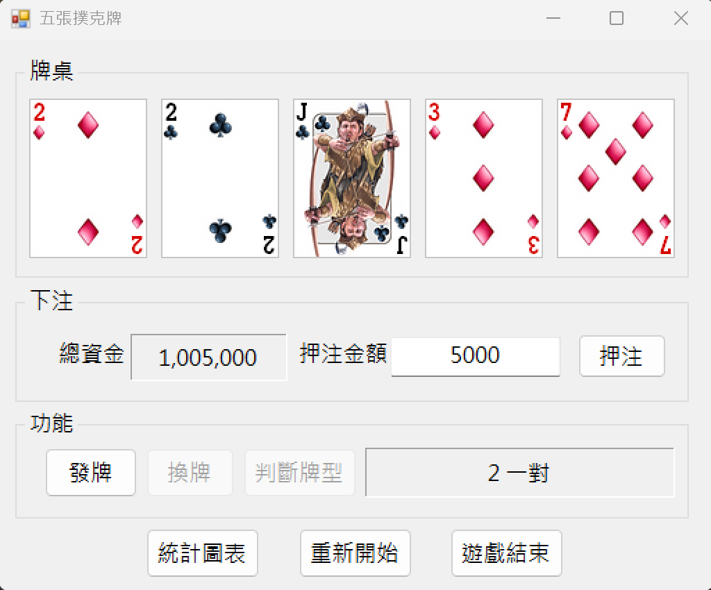
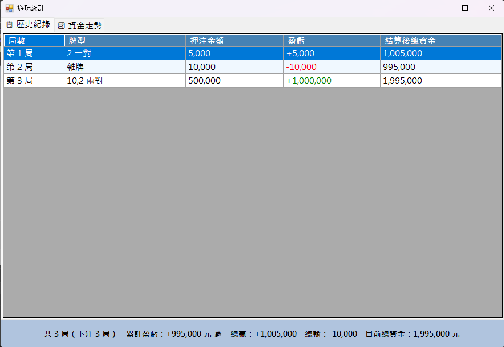
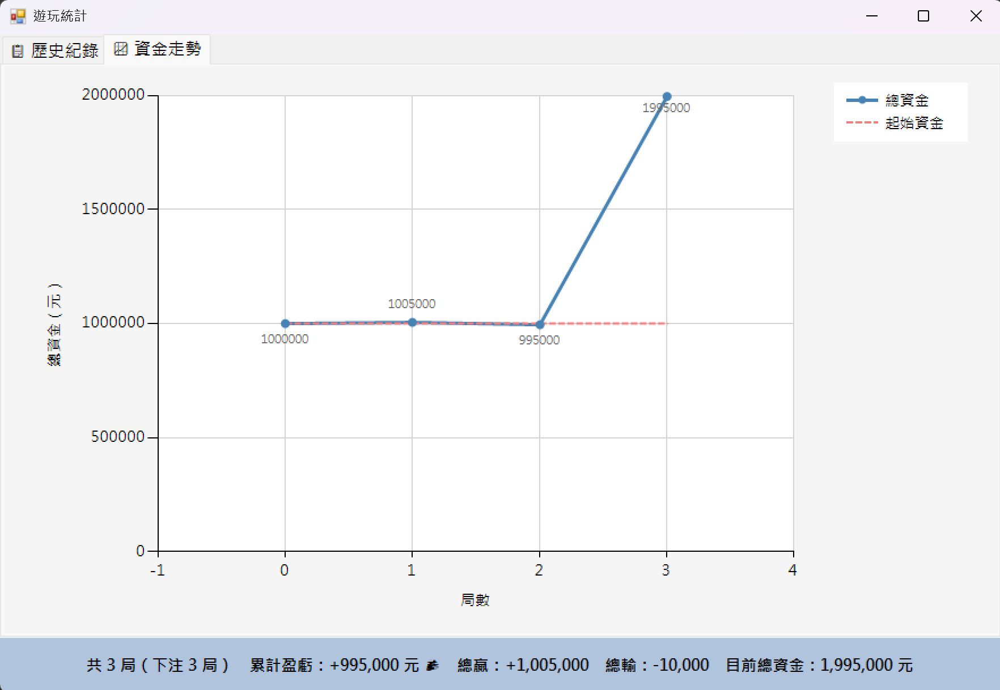

# FiveCardPoker 五張撲克牌

一個用 C# Windows Forms 寫的五張撲克牌遊戲，支援押注、換牌、牌型判斷與遊玩統計。

## 遊戲流程

1. 開啟程式後會顯示起始資金（1,000,000 元）。
2. 在「押注金額」欄位輸入本局要押的金額，按下「押注」確認。
3. 按「發牌」發出五張隨機牌。
4. 點擊想換掉的牌（牌面會翻回背面表示選中），再按「換牌」補入新牌。
5. 按「判斷牌型」查看牌型並自動結算。
6. 結算後押注區解鎖，可以繼續下一局。

```
備註：
Tab 鍵順序為：押注金額 → 押注 → 發牌 → 換牌 → 判斷牌型
PictureBox 已設定 TabStop = false，不會被 Tab 鍵選到。
```

## 賠率表

| 牌型 | 賠率 |
|------|------|
| 皇家同花順 | x250 |
| 同花順 | x50 |
| 四條（鐵支） | x25 |
| 葫蘆 | x9 |
| 同花 | x6 |
| 順子 | x4 |
| 三條 | x3 |
| 兩對 | x2 |
| 一對 | x1 |
| 雜牌 | 輸（扣除押注金額） |

賺錢時結算：`押注金額 × 賠率`，虧損時扣除全部押注金額。

## 功能說明

**統計圖表**：顯示從本次開啟（或上次重新開始）後的所有遊玩紀錄，包含：
- ?? 歷史紀錄：每局的牌型、押注、盈虧（綠色為賺、紅色為虧）、結算後總資金
- ?? 資金走勢：折線圖顯示每局後的總資金變化，附起始資金基準線

**重新開始**：顯示本次遊戲總盈虧後，確認重置資金與所有紀錄。

**遊戲結束**：顯示本次遊戲總盈虧後，確認關閉程式。

## 輸入驗證

| 欄位 | 驗證條件 |
|------|------|
| 押注金額 | 正整數，且不可超過目前總資金 |

```
押注成功後，金額欄與押注按鈕會鎖定，判斷牌型結算完才會解鎖。
若總資金歸零，發牌與押注功能會一併停用。
```

## 測試快捷鍵

按下發牌後可用鍵盤快速設定特定牌型，方便測試：

| 按鍵 | 牌型 |
|------|------|
| Q | 同花大順 |
| W | 同花順 |
| E | 同花 |
| R | 鐵支 |
| T | 葫蘆 |
| Y | 三條 |

## 執行環境

- Windows 10 / 11
- .NET Framework 4.7.2 以上
- Visual Studio 2022（建議）

折線圖功能需要在專案加入 `System.Windows.Forms.DataVisualization` 參考：
右鍵專案 → 加入參考 → 組件 → 架構 → 搜尋 `DataVisualization` → 打勾確認。

## 截圖




